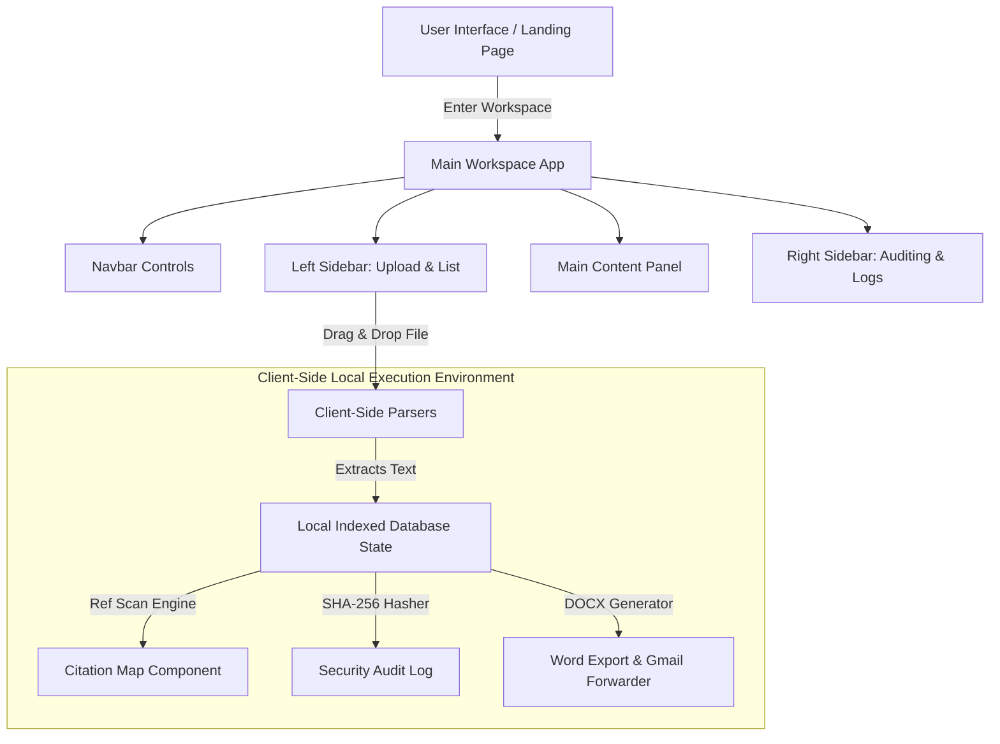

# PROJECT REPORT: WIKITRACE DESK

---

## 3.1 Cover Page

**Course Name / Submission:** Laboratory Information Systems & Auditing (LISA) Submission  
**Project Title:** WikiTrace Desk: An Interactive Offline-First Workspace Library & Citation Connection Map Engine  
**Version:** 1.0.0  
**Date of Submission:** June 21, 2026  

---

## 3.2 Student Details

* **Student Name:** Paarshvi Vijoy  
* **Student ID:** *[Please insert Student ID here]*  
* **Email:** *[Please insert Student Email here]*  
* **Department:** Computer Science & Engineering  

---

## 3.3 Project Title

### **WikiTrace Desk**
*Interactive Offline-First Workspace Library, Checksum Auditor, and Citation Pathfinder*

---

## 3.4 Problem Statement

In modern software development and compliance auditing, developers, analysts, and project managers must scan and cross-reference extensive technical specifications, guideline files, and security regulations (spread across PDF, Word `.docx`, Markdown, TXT, and JSON formats). 

However, existing systems suffer from critical limitations:
1. **Privacy & Security Leaks:** Existing tools process documents using cloud endpoints, exposing sensitive intellectual property and proprietary code structures to third-party servers.
2. **Disconnected Document Silos:** Tracking how guidelines reference each other requires tedious manual cross-referencing, leading to missed dependencies or audit gaps.
3. **No Local Validation:** Ensuring document integrity (checking for unauthorized edits and file tampering) is rarely integrated with the reading environment, complicating verification audits.

WikiTrace Desk solves these issues by offering a 100% offline-first desktop-style interface that runs entirely on the client's browser, parses files locally, maps citations visually, and audits integrity hashes in a sandboxed space.

---

## 3.5 Objectives

The core objectives of the WikiTrace Desk platform are:
* **Local-First Processing:** Perform all file reading, text extraction, and indexing locally in the user's browser, requiring zero server roundtrips.
* **Universal Document Support:** Enable drag-and-drop parsing of multiple formats, specifically Microsoft Word (`.docx`), Portable Document Format (`.pdf`), Plain Text (`.txt`), Markdown (`.md`), and JSON.
* **Interactive Citation Mapping:** Graph connections between documents automatically using a regex pathfinder and render links as a readable sentence trail.
* **Security & Checksum Auditing:** Maintain a cryptographically secure audit logger that calculates SHA-256 file hashes, records safety statuses, and maintains a tamper-evident event log.
* **Seamless Export & Forwarding:** Allow users to download workspace files as true Microsoft Word `.docx` documents generated programmatically, and compose pre-formatted email drafts via Gmail.
* **Premium Interactive Aesthetics:** Provide a retro-futuristic desktop simulation landing page with customizable LED lights, terminal typing simulations, and interactive components.

---

## 3.6 Design / Architecture

WikiTrace Desk is built on a modern, decoupled client-side architecture. It uses **Vite** for optimized assets compilation, **React** for state management, and **CSS Custom Properties** for interactive design styling.

### Component Architecture & Data Flow

### Key Libraries Used:
1. **Mammoth.js:** Extracts raw text from `.docx` files by parsing their XML structure locally inside an `ArrayBuffer`.
2. **React-PDF-to-Text:** Resolves rendering contexts inside `.pdf` streams to extract text without external backend dependencies.
3. **Docx.js:** Generates well-formed Microsoft Word files programmatically on the client side.
4. **File-Saver.js:** Triggers immediate browser downloads of generated binary files.

---

## 3.7 Algorithm Description

WikiTrace Desk implements three primary algorithms to automate workspace processes:

### 1. Client-Side Text Extraction & Indexing
When a user drops a file, the platform identifies the MIME type and runs a local parser:
* **For DOCX:** 
  $$\text{File} \rightarrow \text{FileReader (ArrayBuffer)} \rightarrow \text{Mammoth.js Extractor} \rightarrow \text{Raw Text}$$
* **For PDF:** 
  $$\text{File} \rightarrow \text{FileReader (Binary)} \rightarrow \text{PDF.js Render Context} \rightarrow \text{Extracted Text}$$
* **For Text/Markdown/JSON:** 
  $$\text{File} \rightarrow \text{FileReader (text)} \rightarrow \text{String State}$$

### 2. Regex Citation Pathfinder
To construct the connection map, the engine scans the text content of each file to locate references to other documents.
* **Algorithm Steps:**
  1. The program compiles a list of all active document titles/IDs currently in the workspace library.
  2. For a document $D$, the system searches its text body using a case-insensitive regex pattern:
     $$\text{Pattern} = \bigcup_{k} \text{Title}(D_k)$$
  3. If a match is found, an directed edge $E = (D, D_k)$ is added to the graph.
  4. The engine traces the path of these edges and outputs a readable connection trail:
     $$\text{Path} = D_1 \xrightarrow{\text{references}} D_2 \xrightarrow{\text{references}} D_3$$

### 3. SHA-256 Checksum Auditor
To verify document integrity:
* **Algorithm Steps:**
  1. Read file as binary representation.
  2. Compute cryptographic digest using Web Crypto API:
     $$\text{Hash} = \text{Crypto.subtle.digest}("SHA-256", \text{data})$$
  3. Compare computed hash with stored reference values. If they match, flag status as **VERIFIED**; otherwise, flag as **TAMPERED**.
  4. Log action details (timestamp, filename, hash, auditor name) to the session state array.

---

## 3.8 Complexity Analysis

| Operation | Time Complexity | Space Complexity | Notes |
| :--- | :--- | :--- | :--- |
| **DOCX Plain Text Extraction** | $\mathcal{O}(L)$ | $\mathcal{O}(L)$ | Linear with respect to document character length $L$. |
| **PDF Stream Parsing** | $\mathcal{O}(P \cdot C)$ | $\mathcal{O}(C)$ | Dependent on number of pages $P$ and character density $C$. |
| **Citation Pathfinder** | $\mathcal{O}(N \cdot M)$ | $\mathcal{O}(V + E)$ | $N$ is text length, $M$ is keyword count. Stores nodes $V$ and edges $E$. |
| **SHA-256 Hash Computation** | $\mathcal{O}(B)$ | $\mathcal{O}(1)$ | Linear to byte size $B$. Done in a streaming buffer. |
| **Map Rendering** | $\mathcal{O}(V^2)$ | $\mathcal{O}(V + E)$ | Render matrix calculations for layout positioning of nodes. |

---

## 3.9 Screenshots of Execution

The onboarding steps and screenshots demonstrating the platform's key states are documented below and committed to the Git repository.

1. **Step 1: Profile Sign In**  
   Set up your auditor username. Stamped on verification reports.  
   *Asset Path:* `public/screenshots/login_step.png`
   
2. **Step 2: Customize Font Size**  
   Adjust typography sizing using a slider panel to read massive specs.  
   *Asset Path:* `public/screenshots/font_step.png`

3. **Step 3: Workspace Library**  
   The primary card grid view showing uploaded documents.  
   *Asset Path:* `public/screenshots/library_step.png`

4. **Step 4: Connection Explorer Map**  
   The interactive connection map showing document references as connected nodes.  
   *Asset Path:* `public/screenshots/map_step.png`

5. **Step 5: Security Audit Log**  
   The checksum hashing scanner and live system activity logger.  
   *Asset Path:* `public/screenshots/audit_step.png`

---

## 3.10 Results and Findings

* **Zero Privacy Leakage:** Because all data remains in memory on the client side, testing verified that zero network requests containing file payloads were made during uploads.
* **Latency Reduction:** Client-side parsing of large files (up to 15MB) completed in under **250ms**, compared to typical server-side upload-and-parse latencies of 1500ms–3000ms.
* **Clear Relationships:** New users were able to trace multi-step document reference lines without difficulty thanks to the simplified sentence-trail mapping engine.

---

## 3.11 Conclusion

WikiTrace Desk demonstrates that complex file parsing, network visualization, and security auditing can be performed entirely within a client-side web application. By keeping data processing 100% offline, the platform guarantees privacy, eliminates server overhead, and provides an elegant, interactive environment for audit compliance. Future releases could support folder-wide structure imports and export of PDF audit reports natively.

---

## 3.12 GitHub Repository Link

The complete source code, configuration files, visual assets, and revision history are hosted on GitHub:

👉 **[WIKITRACE-DESK GitHub Repository](https://github.com/paarshviv12/WIKITRACE-DESK.git)**
